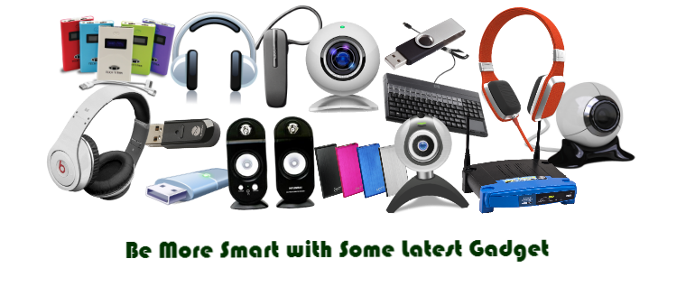

## I'm a soothsayer but I can't 'tell myself'!

# An Electronics App Store 

##  ##
---

### Links to the deployed final PERN Assessment  ###

- [BackEnd](https://pern-backend.herokuapp.com/)

- [FrontEnd](https://pern-frontend.netlify.app/)

# Index Page IndexPage-brn
Matches criteria for RESTful Route

This criterion is linked to a Learning Outcome
# Show Page  ShowPage-brn
Matches criteria for RESTful Route

This criterion is linked to a Learning Outcome

# New Page or Component (form) create-brn
Matches criteria for RESTful Route

This criterion is linked to a Learning Outcome
# Create Functionality  
Matches criteria for RESTful Route

This criterion is linked to a Learning Outcome
# Edit Page or Component (form) Edit-brn
Matches criteria for RESTful Route

This criterion is linked to a Learning Outcome
# Update Functionality       
Matches criteria for RESTful Route

This criterion is linked to a Learning Outcome
# Delete Functionality   delete-brn
Matches criteria for RESTful Route